# SMARTPOS

## Navigate to the mobile directory
   ```bash
   cd pos-mobile
   ```
 

1. Install dependencies

   ```bash
   npm install
   ```

2. Start the app

   ```bash
   npx expo start
   ```

## Start the JSON server on port 5005

 ```bash
npx json-server data/db.json --port 5005
   ```


## Screenshots  

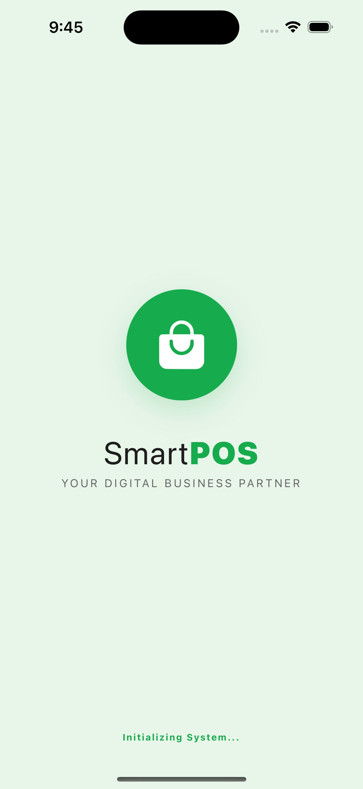  
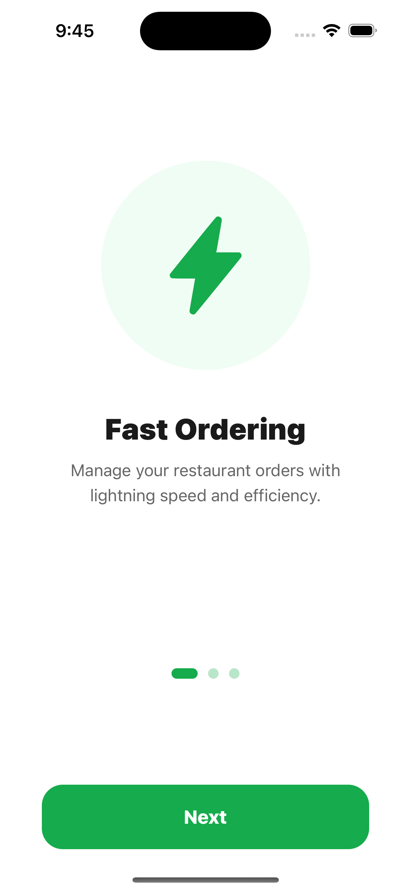  
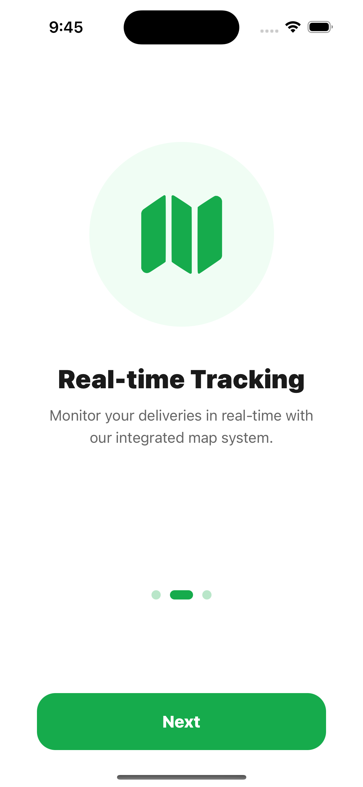  
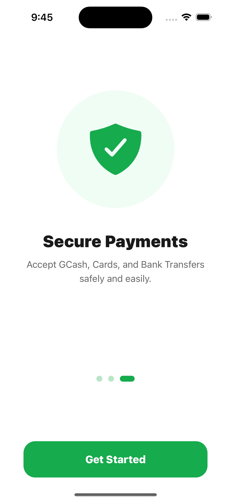  
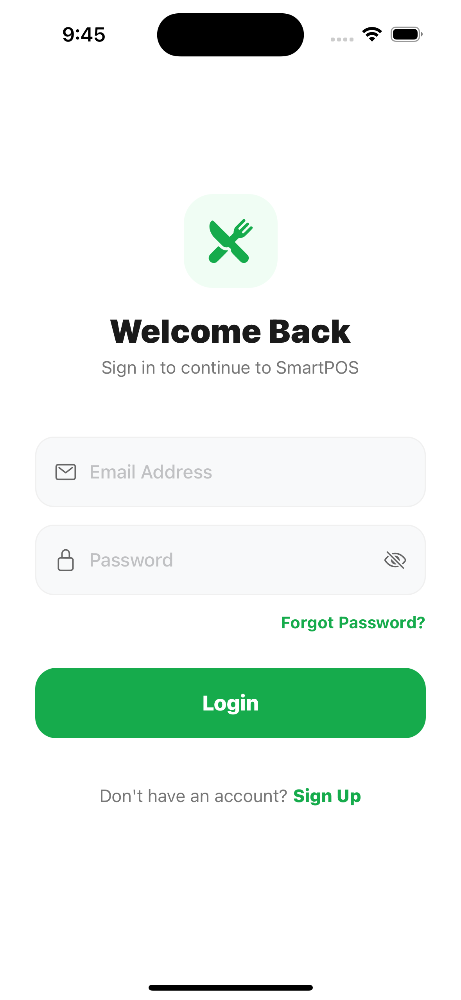  
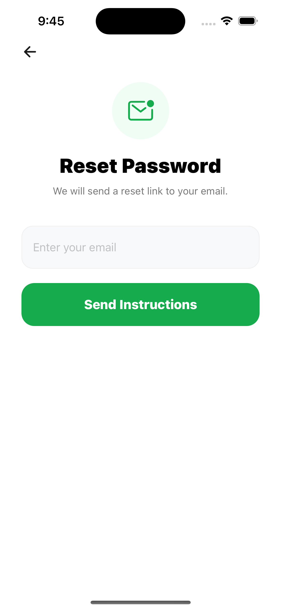  
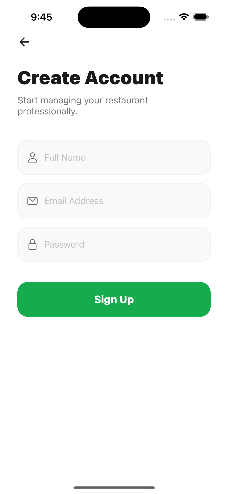  
  
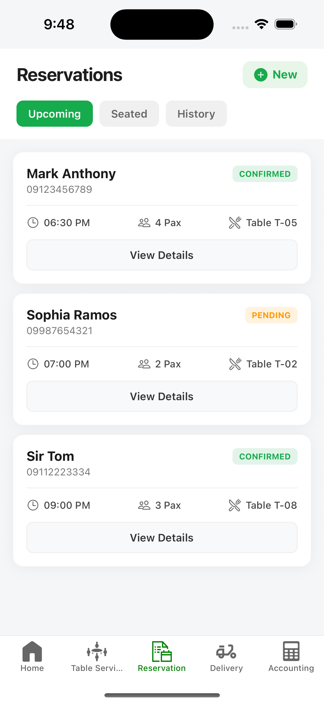
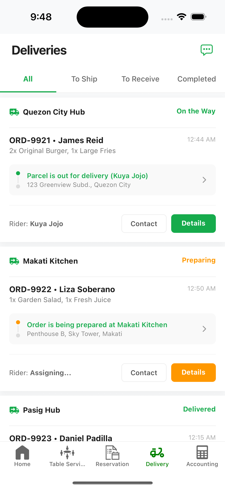

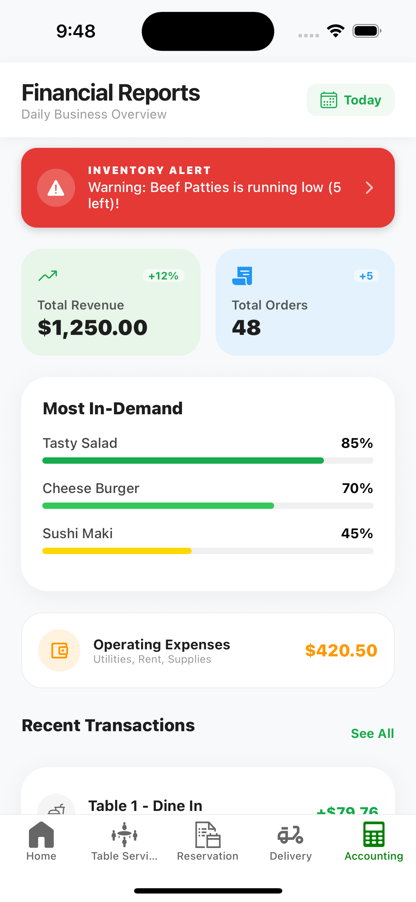
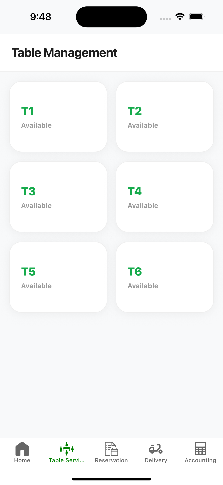

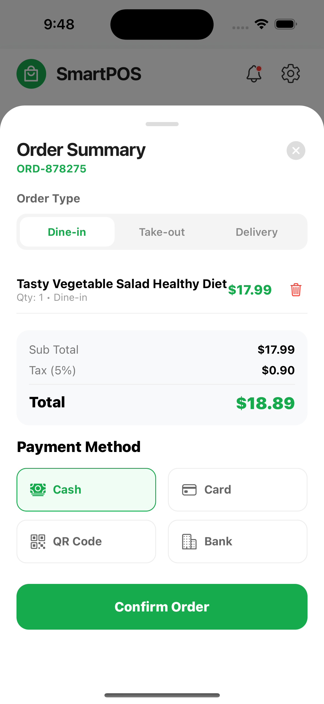
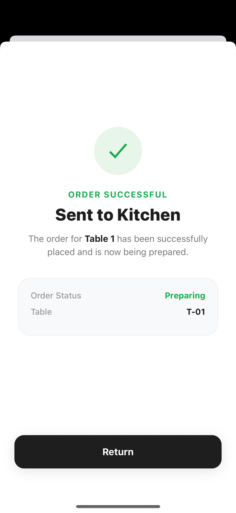

#Fx evrythng 
